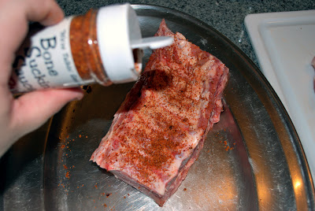

# Pork Baby Back Ribs :hotsprings: 

  

### :octocat: Ingredients

RUB:

- 2 tablespoons of refined salt
- 2 tablespoons of brown sugar
- 1 tablespoon spicy paprika
- 4 teaspoons granulated garlic 
- 4 teaspoons chile powder
- 2 teaspoons ground black and white peppers

MOP:
- 1 cup fresh apple juice
- 3 tablespoons apple cider vinegar
- 2 tablespoons butter
- 2 tablespoons barbecue sauce
- 1/2 tablespoon of RUB used to season the ribs
 
 
 
### :construction: Method

#### 1.	Preparing the ribs 🔪

The first thing to be done is to clean the ribs. Start with the side of the bones. If you have any pieces of meat on this side (as in the example above), take it off completely. On this side, only the bones should appear.

  

Now just pull the membrane, if you're lucky it comes out in one piece. The tip is to pull with the help of a paper towel because it is exceptionally smooth and slippery.

This Youtube video shows this operation well: [How to remove Membrane from Pork Ribs | Tips](https://www.youtube.com/watch?v=d_fqJcc4n_I&t=35s)

#### 2. Ribs Seasoning 🧂

Ribs are usually seasoned when it comes to going to the grill. At most 2 to 3 hours before, but I do not think it necessary since the cooking process is long for seasoning act. The baby back ribs use a dry seasoning known as RUB (ingredients above).

Put all the ingredients in a container and mix well. It´s ready! After seasoning just store in a container with lid and enjoy again.

Start by seasoning the ribs from the side of the bone. On this side just give a spread of the RUB, do not need to exaggerate:

  

*Turn the rib and pass plenty of seasoning on the meat side. Press the seasoning well so that it penetrates the meat.

#### 3.	The grill is on 🔥

To bake the ribs you will use indirect fire, that is, the ribs will not be directly on top of the charcoal so as not to burn. And you will use a disposable aluminum packaging with water.

  

The detail before putting the ribs to bake is the temperature of the barbecue. It has to be "low and slow" that is, the process is slow, and the temperature has to be low, or your rib will get hard.

#### 4.	MOP, reinforcement on the way... 🍎

The MOP (recipe above) is a liquid marinade for you to brush on the ribs during the cooking process. In addition to helping the ribs get wetter and tender, it also helps to strengthen the seasoning.
In a small saucepan add all the ingredients and heat for a few minutes until the butter melts. Turn off the heat and the MOP is ready.

  

### :spoon: Finishing

After two hours of cooking, it is time to put more charcoal... enjoy removing the ribs from the barbecue and give a good brush stroke with the MOP on them.... spread well on both sides.
The process should still last another two hours (four hours in total) depend on the thickness of the rib.... every half-hour be sure to brush the MOP and check the temperature.... after four hours the ribs should be well toasted and soft, almost loosening the bone...

  

  

  

THAT´S IT!!! I suggest serving them with a bacon-garlic mashed potatoes or potatoes with cheese and bacon.... is a perdition… do not forget the extra dose of barbecue sauce...... ENJOY !!!!!!!!!

  

##### *** Adapted from [Tailgate: Pork Ribs](http://tail-gate.blogspot.com/2008/11/pork-ribs.html)
