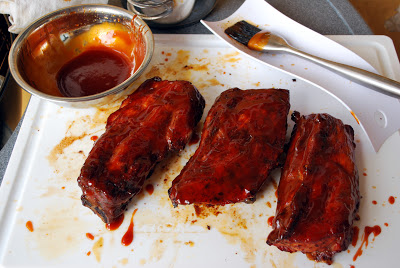

# Pork Baby Back Ribs :hotsprings: 

  

### :octocat: Ingredients

RUB:

- 2 tablespoons of refined salt
- 2 tablespoons of brown sugar
- 1 tablespoon spicy paprika
- 4 teaspoons granulated garlic 
- 4 teaspoons chile powder
- 2 teaspoons ground black and white peppers

MOP:
- 1 cup fresh apple juice
- 3 tablespoons apple cider vinegar
- 2 tablespoons butter
- 2 tablespoons barbecue sauce
- 1/2 tablespoon of RUB used to season the ribs

### :construction: Method

#### 1.	Preparing the ribs

#### 2. Seasoning ribs

#### 3.	The grill is on

#### 4.	MOP, reinforcement on the way...

### :spoon: Finishing

After two hours of cooking, it is time to put more charcoal... enjoy removing the ribs from the barbecue and give a good brush stroke with the MOP on them.... spread well on both sides.
The process should still last another two hours (four hours in total) depend on the thickness of the rib.... every half-hour be sure to brush the MOP and check the temperature.... after four hours the ribs should be well toasted and soft, almost loosening the bone...

  

  

  

THAT´S IT!!! I suggest serving them with a bacon-garlic mashed potatoes or potatoes with cheese and bacon.... is a perdition… do not forget the extra dose of barbecue sauce...... ENJOY !!!!!!!!!

  

##### *** Adapted from [Tailgate: Pork Ribs](http://tail-gate.blogspot.com/2008/11/pork-ribs.html)
